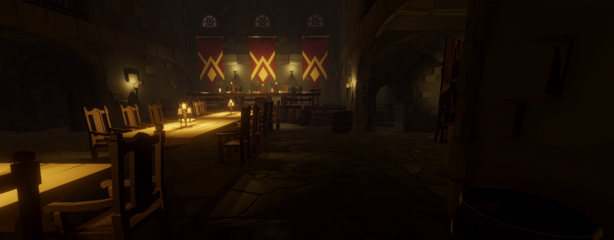
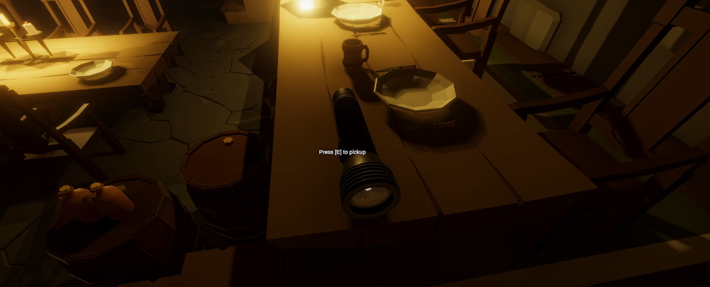
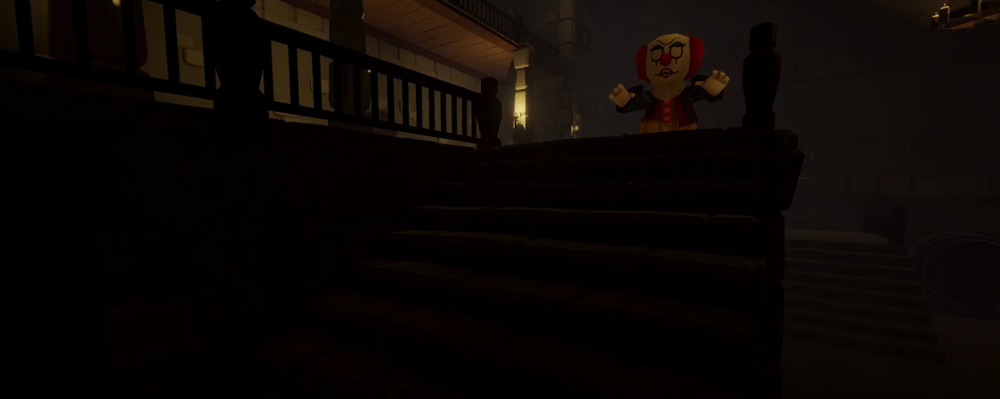
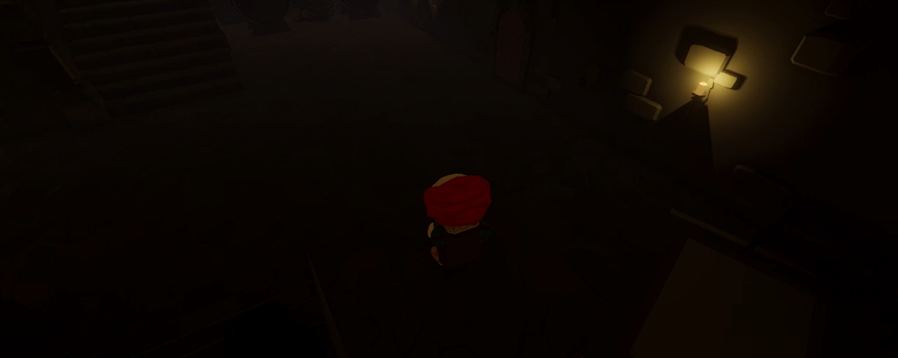
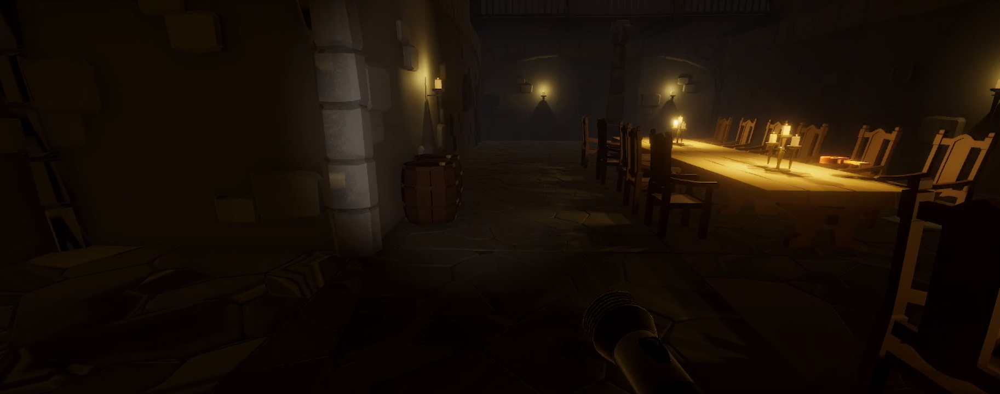

# Crypt of the Clown 🤡🔐

*Crypt of the Clown* is a first-person horror game where players navigate a dark dungeon filled with puzzles and the lurking threat of a malevolent clown. The objective is to solve puzzles, gather items, and make it to the end of the dungeon without falling victim to the clown.

## 🛠️ About the Game

In *Crypt of the Clown*, players must use their wits and stealth to survive. The game features a first-person movement system, an inventory for managing essential items, and a dynamic AI system for the clown that tracks players through a vision cone. The immersive atmosphere is enhanced with post-processing effects, adding depth and tension to the dungeon setting.

## 🎯 Features

- **First-Person Movement**:
  - Smooth, responsive controls for navigating the dungeon environment.
- **Inventory System**:
  - Store and manage keys, notes, and flashlights.
- **Dynamic AI Enemy**:
  - The clown uses a vision cone to track the player, allowing for strategic stealth gameplay.
- **Puzzle Solving**:
  - Engage with various puzzles to unlock doors and progress through the dungeon.
- **Immersive Atmosphere**:
  - Enhanced with Unity's Universal Render Pipeline (URP) and post-processing effects for a truly eerie experience.

## 🚀 What I Learned

- **3D Movement Mechanics**:
  - Developed a robust first-person movement system.
- **Inventory Management**:
  - Implemented an interactive inventory system to manage in-game items.
- **Post-Processing Effects**:
  - Enhanced visual fidelity and atmosphere using URP and post-processing.
- **AI Development**:
  - Created a responsive enemy AI that reacts to player movements and implements a vision cone for tracking.
- **Puzzle and Door Mechanics**:
  - Designed and implemented various puzzles and door systems to challenge players and guide progression.

## 🔧 Built With

- **Engine**: Unity (URP)
- **Language**: C#
- **Development Time**: (Add development duration here)

## 📷 Screenshots







## 📂 How to Play

1. Clone the repository:
   ```bash
   git clone https://github.com/Hessine-Lengliz/CryptOfTheClown.git
Open the project in Unity (version XX.X.X or later).
Press the Play button to start the game.
Navigate the dungeon, solve puzzles, and avoid the clown to escape!
📢 Feedback
Step into the eerie world of Crypt of the Clown! If you have any feedback, feel free to open an issue or reach out via:

Email: [Your Email]
GitHub Profile: [Your GitHub Profile]
🛠️ Languages and Tools
<p align="left"> <a href="https://unity.com/" target="_blank" rel="noreferrer">  </a> <a href="https://www.cprogramming.com/" target="_blank" rel="noreferrer">  </a> <a href="https://git-scm.com/" target="_blank" rel="noreferrer">  </a> </p> ```
